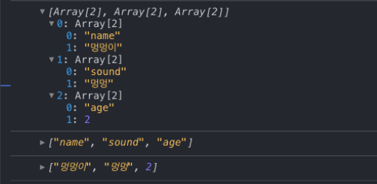
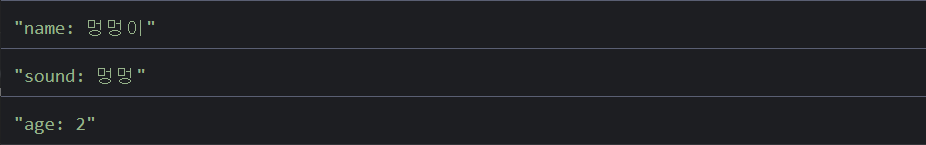

//# 자바스크립트 입문

## ５. 함수
### ５.１ 일반 함수
```javascript
function add(a, b) {
  return a + b;
}

const sum = add(1, 2);
console.log(sum);
```
함수를 만들 때는 `function` 키워드를 사용하며, 함수에서 어떤 값을 받아올지 정해주는데 이를 파라미터(매개변수)라고 부름.  

함수 내부에서 `return` 키워드를 사용하여 함수의 결과물을 지정 가능


##### 연습
name 이라는 파라미터를 넣으면 콘솔에 'Hello name!' 이라는 결과를 출력하는 코드를 작성해보자.
```javascript
function hello(name) {
    console.log(`Hello ${name}!`);
}

hello('Mike'); // "Hello Mike!"
```

### ５.２ 화살표 함수
```javascript
const add = (a, b) => {
    return a + b;
};

console.log(add(1, 2));
```
`function` 키워드 대신에 `=>` 문자를 사용해서 함수를 구현함  
화살표의 좌측에는 함수의 **파라미터**, 화살표의 우측에는 **코드 블록**이 들어옴  

위와 같이 코드 블록 내부에서 바로 return 을 하는 경우는 다음과 같이 줄여서 쓸 수 있음
```javascript
const add = (a, b) => a + b;
console.log(add(1, 2));
```

# ６. 객체
## ６.１ 객체 선언
```javascript
const dog = {
    name: '멍멍이',
    age: 2
};

console.log(dog.name); // 멍멍이
console.log(dog.age);  // 2
```

객체 선언 시`{ }` 안에 원하는 값들을 넣어줌.  
값은 `키: 원하는 값` 형태로 넣고,  

키에 해당하는 부분은 공백이 없어야함. 공백이 있어야 하는 경우, 따옴표로 감싸서 문자열로 넣어줌  
```javascript
const sample = {
  'key with space': true
};
```
## ６.２ 함수에서 객체를 파라미터로 받기
객체를 파라미터로 받아와서 사용해보자.  
```javascript
const ironMan = {
  name: '토니 스타크',
  actor: '로버트 다우니 주니어',
  alias: '아이언맨'
};

function print(hero) {
    const text = `${hero.alias}(${hero.name}) 역할을 맡은 배우는 ${hero.actor} 이다.`;
    console.log(text);
}

print(ironMan); // "아이언맨(토니 스타크) 역할을 맡은 배우는 로버트 다우니 주니어 이다."
```

## ６.３ 객체 비구조화 할당
print 함수에서 hero 내부의 값을 조회 할 때 마다 `hero.` 를 입력하고 있는데, 객체 비구조화 할당이라는 문법을 사용하면 코드를 더욱 짧고 보기 좋게 작성 할 수 있음 
```javascript
const ironMan = {
  name: '토니 스타크',
  actor: '로버트 다우니 주니어',
  alias: '아이언맨'
};

function print(hero) {
    const { alias, name, actor } = hero; // [객체 비구조화 할당] 객체에서 값들을 추출해서 새로운 상수로 선언함
    const text = `${alias}(${name}) 역할을 맡은 배우는 ${actor} 이다.`;
    console.log(text);
}

print(ironMan); // "아이언맨(토니 스타크) 역할을 맡은 배우는 로버트 다우니 주니어 이다."
```

여기서 더 나아가, 파라미터 단계에서 객체 비구조화 할당을 할 수도 있음
```javascript
const ironMan = {
  name: '토니 스타크',
  actor: '로버트 다우니 주니어',
  alias: '아이언맨'
};

function print({ alias, name, actor }) { // 객체 비구조화 할당
    const text = `${alias}(${name}) 역할을 맡은 배우는 ${actor} 이다.`;
    console.log(text);
}
print(ironMan);
```

## ６.４ 객체 안에 함수 넣기
```javascript
const dog = {
    name: '강아지',
    sound: '멍멍',
    say: function bark() {
        console.log(this.sound); // this: 자신이 속한 객체를 가르킴
    },
    say2: function() { // 함수 이름 없이 선언 가능
        console.log(this.sound);
    }
};

dog.say(); // 멍멍
dog.say2(); // 멍멍
```
객체 안에 함수를 넣을 때, 화살표 함수로 선언한다면 제대로 작동하지 않음.  

이유는, function 으로 선언한 함수는 this 가 제대로 자신이 속한 객체를 가르키게 되는데, 화살표 함수는 그렇지 않기 때문

## ６.５ Getter 함수와 Setter 함수
```javascript
const numbers = {
  a: 1,
  b: 2,
  get sum() {
    console.log('sum 함수 실행!');
    return this.a + this.b;
  }
};

console.log(numbers.sum);
```
```console
"sum 함수 실행!"
3
```
 `numbers.sum()` 을 한 것이 아니라 `number.sum` 을 조회했을 뿐인데, 함수가 실행되고 그 결과값이 출력됨

```javascript
const numbers = {
  _a: 1,
  get a() {
    return this._a;
  },
  set a(value) {
    console.log('a 값을 변경');
    this._a = value;
  }
};

numbers.a = 7; // setter 함수의 파라미터로 5를 전달
console.log(numbers.a); // getter 함수로 값 조회

```
Setter 함수를 설정 할 때에는 함수의 앞부분에 `set` 키워드를 붙임  
Setter 함수를 설정하고 나면, `numbers.a = 5` 이렇게 값을 설정했을 때 5 를 함수의 파라미터로 받아오게 됨  

## ６.６ 객체의 정보를 배열 형태로 받아오는 함수
```javascript
const doggy = {
  name: '멍멍이',
  sound: '멍멍',
  age: 2
};

console.log(Object.entries(doggy));
console.log(Object.keys(doggy));
console.log(Object.values(doggy));
```


각 함수의 역할은 다음과 같음
-   `Object.entries`: `[[키, 값], [키, 값]]` 형태의 배열로 변환
-   `Object.keys`: `[키, 키, 키]` 형태의 배열로 변환
-   `Object.values`: `[값, 값, 값]` 형태의 배열로 변환


# ７. 배열
## ７.１ 배열 선언 및 조회
- 배열 선언시 `[ ]` 로 감싸줌
```javascript
const array = [1, 2, 3, 4, 5]; // 숫자 배열

const objects = [{ name: '멍멍'}, { name: '야옹' }]; // 객체 배열
```

- 1 번째 항목 조회
```javascript
console.log(objects[1]);
```


- 예제
```javascript
const objects = [{ name: '멍멍이' }, { name: '야옹이' }];

console.log(objects);
console.log(objects[0]);
console.log(objects[1]);
```


## ７.２ 배열에 새 항목 추가 - push
배열의 내장 함수인 `push` 함수를 사용함
```javascript
const objects = [{ name: '멍멍이' }, { name: '야옹이' }];

objects.push({
  name: '용가리'
});

console.log(objects);
```
## ７.３ 배열의 크기 - length

```javascript
const objects = [{ name: '멍멍이' }, { name: '야옹이' }];

console.log(objects.length); // 2
```

# ８. 반복문
## ８.１ for
```javascript
for (let i = 0; i < 10; i++) {
  console.log(i);
}
```

##### 배열과 for
```javascript
const names = ['멍멍이', '야옹이', '멍뭉이'];

for (let i = 0; i < names.length; i++) {
  console.log(names[i]);
}
```
## ８.２ while
```javascript
let i = 0;
while (i < 10) {
  console.log(i);
  i++;
}
```

## ８.３ 배열을 위한 반복문 for...of
`for...of`문은 배열에 관한 반복문을 돌리기 위해서 만들어진 반복문임.

> 사실 이 구문은 배워놔도 사용 할 일이 별로 없습니다. 보통 배열을 반복할때에는 배열의 내장함수를 많이 사용합니다. 그래도 알아는 둡시다.

```javascript
let numbers = [10, 20, 30, 40, 50];
for (let number of numbers) {
  console.log(number);
}
```
```console
10
20
30
40
50
```

## ８.４ 객체를 위한 반복문 for...in
```javascript
const doggy = {
  name: '멍멍이',
  sound: '멍멍',
  age: 2
};

for (let key in doggy) {
  console.log(`${key}: ${doggy[key]}`);
}
```


## ８.５ break 와 continue
```javascript
for (let i = 0; i < 10; i++ ) {
  if (i === 2) continue; // 다음 루프를 실행
  console.log(i);
  if (i ===5) break; // 반복문을 끝내기
}
```
```console
1
3
4
5
```

# ９. 배열 내장함수
배열을 다룰 때 알고있으면 너무나 유용한 다양한 내장 함수들을 알아보겠음

## ９.１ forEach
```javascript
const heroes = ['아이언맨', '캡틴 아메리카', '토르', '닥터 스트레인지'];

/* for문으로 배열의 원소들을 출력 */
for (let i = 0; i < heroes.length; i++) {
  console.log(heroes[i])
}
/* 위 동작을 forEach 함수로 구현 */
heroes.forEach(hero => {
  console.log(hero);
});
```
forEach 함수의 파라미터로는, 각 원소에 대하여 처리하고 싶은 코드를 함수로 넣음.  
이 함수의 파라미터 hero는 각 원소를 가르키게 됨

## ９.２ map
`map` 은 배열 안의 각 원소를 변환 할 때 사용 되며, 이 과정에서 새로운 배열이 만들어짐  


배열 안의 모든 숫자를 제곱해서 새로운 배열을 만들고 싶은 경우
```javascript
const array = [1, 2, 3, 4, 5, 6, 7, 8];

const squared = [];

/* 1. 기본적인 방식 */
for (let i = 0; i < array.length; i++) {
  squared.push(array[i] * array[i]);
}

/* 2. 위 동작을 forEach 함수로 구현 */
array.forEach(n => {
  squared.push(n * n);
})

/* 3. 위 동작을 map 함수로 구현 */
const squareFunc = n => n * n; // 변화함수
const squared = array.map(square); // 변화함수를 매개변수로 전달
```
map 함수의 파라미터로 변화를 주는 함수(**변화함수**)를 전달함.  
현재 변화함수 square는 파라미터 n 을 받아와서 이를 제곱해줌.  
map 함수에 변화함수를 사용함으로서 새로운 배열을 생성했음.

변화 함수를 꼭 이름을 붙여서 선언 할 필요는 없음. 다음과 같이 작성해도 됨
```javascript
const squared = array.map(n => n * n);
console.log(squared);
```

## ９.３ indexOf
`indexOf`: 원하는 항목이 몇번째 원소인지 찾아주는 함수
```javascript
const superheroes = ['아이언맨', '캡틴 아메리카', '토르', '닥터 스트레인지'];
const index = superheroes.indexOf('토르');
console.log(index); // 2
```

## ９.４ findIndex
배열 안에 있는 값이 객체이거나, 배열이라면 indexOf 로 찾을 수 없음.  
예를 들어 다음과 같은 배열이 있을 때,
```javascript
const todos = [
  {
    id: 1,
    text: '자바스크립트 입문',
    done: true
  },
  {
    id: 2,
    text: '함수 배우기',
    done: true
  },
  {
    id: 3,
    text: '객체와 배열 배우기',
    done: true
  },
  {
    id: 4,
    text: '배열 내장함수 배우기',
    done: false
  }
];
```
여기서 만약 id 가 3 인 객체가 몇번째인지 찾으러면, `findIndex` 함수에 검사하고자 하는 조건을 반환하는 함수를 넣어서 찾을 수 있음
```javascript
const todos = [
  {
    id: 1,
    text: '자바스크립트 입문',
    done: true
  },
  {
    id: 2,
    text: '함수 배우기',
    done: true
  },
  {
    id: 3,
    text: '객체와 배열 배우기',
    done: true
  },
  {
    id: 4,
    text: '배열 내장함수 배우기',
    done: false
  }
];

const index = todos.findIndex(todo => todo.id == 3);
console.log(index); // 2
```

## ９.５ find
`find` 함수는 `findIndex` 랑 비슷한데, 찾아낸 값이 몇번째인지 알아내는 것이 아니라, 찾아낸 값 자체를 반환함
```javascript
const todos = [
  {
    id: 1,
    text: '자바스크립트 입문',
    done: true
  },
  {
    id: 2,
    text: '함수 배우기',
    done: true
  },
  {
    id: 3,
    text: '객체와 배열 배우기',
    done: true
  },
  {
    id: 4,
    text: '배열 내장함수 배우기',
    done: false
  }
];

const index = todos.find(todo => todo.id == 3);
console.log(index); // 2
```
```console
{id: 3, text: "객체와 배열 배우기", done: true}
```

## ９.６ filter
`filter` 함수는 배열에서 특정 조건을 만족하는 값들만 따로 추출하여 새로운 배열을 만듦.  
파라미터로 조건을 검사하는 함수를 넣어줌  

예)  todos 배열에서 done 값이 false 인 항목들만 따로 추출해서 새로운 배열 만들기
```javascript
const todos = [
  {
    id: 1,
    text: '자바스크립트 입문',
    done: true
  },
  {
    id: 2,
    text: '함수 배우기',
    done: true
  },
  {
    id: 3,
    text: '객체와 배열 배우기',
    done: true
  },
  {
    id: 4,
    text: '배열 내장함수 배우기',
    done: false
  }
];

const taskNotDone = todos.filter(todo => todo.done === false);
console.log(taskNotDone);
```
```
[
  {
    id: 4,
    text: '배열 내장 함수 배우기',
    done: false
  }
];
```

## ９.７ splice
`splice`는 배열에서 특정 항목을 제거할 때 사용  `
	- 첫 번째 파라미터: 어떤 인덱스부터 지울지를 의미  
	- 두 번째 파라미터: 그 인덱스부터 몇개를 지울지를 의미  
	

ex) 배열에서 30을 지우는 예
```javascript
const numbers = [10, 20, 30, 40];
const index = numbers.indexOf(30); // 먼저 30이 몇 번째 index인지 알아냄 
numbers.splice(index, 1); // 해당 인덱스부터 1개를 제거
console.log(numbers); 
```
```
[10, 20, 40]
```

## ９.８ slice
`slice` 는 `splice`와 비슷하게 배열을 잘라낼 때 사용하는데, 다른 점은 **기존의 배열은 건들이지 않음**.
	- 첫 번째 파라미터: 어떤 인덱스부터 자를지를 의미  
	- 두 번째 파라미터: 어디까지 자를지를 의미
```javascript
const numbers = [10, 20, 30, 40];
const sliced = numbers.slice(0, 2); // 0부터 시작해서 2전까지

console.log(sliced); // [10, 20]
console.log(numbers); // [10, 20, 30, 40]
```

## ９.９ shift와 pop
`shift()`: 첫번째 원소를 배열에서 추출
`pop()`: 마지막 원소를 배열에서 추출

```javascript
const numbers = [10, 20, 30, 40];
const value = numbers.shift();
console.log(value); // 10
console.log(numbers); // [20, 30, 40]
```
```javascript
const numbers = [10, 20, 30, 40];
const value = numbers.pop();
console.log(value); // 40
console.log(numbers); // [10, 20, 30]
```

## ９.10 unshift
`unshift()`: `shift()` 의 반대로, 배열의 맨 앞에 새 원소를 추가

```javascript
const numbers = [10, 20, 30, 40];
numbers.unshift(5);
console.log(numbers);
```
```console
[5, 10, 20, 30, 40]
```

## ９.11 concat
`concat()` : 여러개의 배열을 하나의 배열로 합침

```javascript
const arr1 = [1, 2, 3];
const arr2 = [4, 5, 6];
const concated = arr1.concat(arr2);

console.log(concated); // [1,2,3,4,5,6]
```
`concat` 함수는 arr1 과 arr2 에 변화를 주지 않음.

## ９.12 join
`join()`: 배열 안의 값들을 문자열 형태로 합침

```javascript
const array = [1, 2, 3, 4, 5];

console.log(array.join()); // 1,2,3,4,5
console.log(array.join('')); // 12345
console.log(array.join(' ')); // 1 2 3 4 5
console.log(array.join(', ')); // 1, 2, 3, 4, 5
```

## ９.13 reduce
// 아 힘드러
https://learnjs.vlpt.us/basics/09-array-functions.html 

